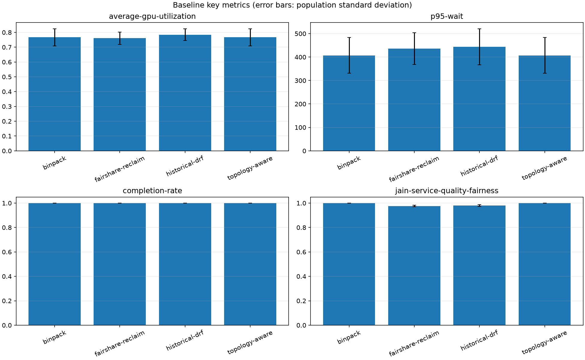

# GPU Scheduler Lab

GPU Scheduler Lab 是一个可复现、可测试、可 benchmark 的 GPU 集群离散事件调度模拟器。MVP 用 synthetic workload 比较基础策略；Phase II 增加生产 trace replay、异构 GPU 型号、层级拓扑、reservation/backfill、抢占开销和可复现实验 manifest；Phase III 加入多租户队列、公平分配、跨队列 reclaim、弹性 gang 和动态 fleet。

它是调度算法实验室，不连接真实 NVIDIA GPU、CUDA 或 Kubernetes，也不是生产调度器。

Python distribution 与主 CLI 均使用 `gpu-scheduler-lab`，当前 release 准备版本为 `0.3.0`；`python -m gpu_scheduler_lab` 是等价模块入口。仓库只准备 release commit，不自动创建 tag 或 GitHub Release。

## Research question

**在固定、可复现的 workload 与容量/拓扑约束下，不同 GPU 调度策略如何在利用率、等待时间、SLA、公平性、碎片、抢占与恢复开销之间取舍？**

所有比较必须复用同一输入和 simulation engine，并同时报告收益、代价与模型边界；本项目不把离散事件结果外推为真实 GPU 或生产 Kubernetes 性能。

## Why

GPU 集群同时面对设备数量、异构显存、gang 作业、优先级和故障域等约束。集群即使有足够的总资源，也可能因为资源散落、显存型号不合适或低优先级作业占用而无法放置新作业。单看吞吐量无法揭示这些取舍，因此本项目以同一 workload 重放多种策略并输出可审计 trace 和指标。

## Architecture

```text
Synthetic / Production Trace / Mini-AI-Cloud Snapshot
        |
        v
 Event Queue ---> Simulator Clock
        |               |
        v               v
   Scheduler ------> Cluster + Topology State
        |
        v
   Placement
        |
        v
 Trace + Metrics
        |
        v
 Experiment Manifest / Benchmark / Charts
```

模型中的 GPU 是独占设备。一个作业占用 GPU 后，其他作业不能共享该设备；`gpu_memory_gb` 用于容量约束和显存浪费计量。所有多 GPU placement 都是原子的，`gang: true` 进一步启用跨节点 gang 指标。

所有阶段复用唯一的 `Scenario -> Simulator -> Scheduler -> Metrics` 路径。Phase III 在 placement 前增加 admission 和 allocation policy，但 GPU 选择仍由已有 scheduler 完成。Trace adapter 只负责 normalization，simulation engine 不读取 Alibaba-specific schema。

```text
Submission -> Admission -> Queue / Fair Share -> Allocation / Reclaim
           -> Placement -> Dynamic Fleet -> Trace / Metrics
```

## Quick start (Ubuntu / WSL)

项目以 Python 3.12 为目标。在 Windows 上请从 Ubuntu WSL 运行：

```bash
cd '/mnt/d/Projects/GPU Scheduler Lab'
uv venv --python 3.12 .venv
uv pip install --python .venv/bin/python -e '.[dev]'

.venv/bin/gpu-scheduler-lab --help
.venv/bin/python -m gpu_scheduler_lab compare \
  --scenario scenarios/demo.yaml \
  --schedulers fifo,binpack,spread,preemptive
```

结果默认写入 `results/`：terminal summary、JSON、CSV、策略比较图和 GPU timeline 都来自本次 simulation trace。

单策略运行：

```bash
.venv/bin/python -m gpu_scheduler_lab benchmark \
  --scenario scenarios/mixed.yaml \
  --scheduler fifo
```

生成可复现 workload：

```bash
.venv/bin/python -m gpu_scheduler_lab generate \
  --profile fragmentation --jobs 500 --nodes 20 --gpus-per-node 8 \
  --seed 42 --output scenarios/fragmentation.generated.yaml
```

可用 `--duration-distribution fixed|exponential|lognormal`、`--gpu-count-distribution 1:0.6,2:0.3,4:0.1`、`--gpu-memory-distribution 20:0.7,40:0.3` 和 `--priority-weights low,normal,high,critical` 覆盖 profile 默认分布；arrival rate、duration、training ratio、gang/SLA probability 与 seed 也都是显式参数。自定义 GPU count 会原样保留；任何值超过集群物理 GPU 总数时生成器会明确报错，不会截断 workload。

内置 profile：

- `mixed`：inference 与 training 混合；
- `fragmentation`：异构显存请求，强调 stranded capacity；
- `burst`：短时间 inference 突发，强调 tail wait 和抢占。
- `topology`：gang-heavy、异构型号和 rack/zone locality 偏好；
- `backfill`：大型长 gang 与短小 Job 混合，制造 reservation window。

导入 Alibaba 2026 spot-GPU trace 的小 fixture：

```bash
.venv/bin/python -m gpu_scheduler_lab trace-import \
  --format alibaba \
  --input tests/fixtures/alibaba_trace_sample \
  --max-jobs 2 \
  --gpu-memory GPU-series-1=24 \
  --output scenarios/alibaba-sample.generated.yaml
```

完整数据的下载、attribution 和 normalization 规则见 [Alibaba trace guide](docs/traces/alibaba.md)。数据默认放在被 Git 忽略的 `.data/`，CI 不下载生产 trace。

正式实验入口：

```bash
.venv/bin/python -m gpu_scheduler_lab experiment --config experiments/topology.yaml
```

每次输出 `manifest.json`、`runs.json`、`summary.csv`、`summary.json` 和 `comparison.png`；manifest 保存 Git SHA、Python 版本、scenario SHA256、trace 版本、scheduler、seed 和 metrics。

## Canonical study contract

正式研究问题、四类策略、指标、实验变量和 hypotheses 固定在
[`study/study.yaml`](study/study.yaml)，其字段、引用和 ID 集合由 CLI 与 CI 校验：

```bash
.venv/bin/python -m gpu_scheduler_lab study validate --config study/study.yaml
```

`binpack`、`topology-aware`、`historical-drf` 和 `fairshare-reclaim` 是正式
study 的封闭策略集合；通用 benchmark CLI 中存在的其他 scheduler 不会因此成为正式
研究策略。指标口径见 [`study/metric-definitions.md`](study/metric-definitions.md)，
hypotheses 见 [`study/hypotheses.md`](study/hypotheses.md)。本合同只冻结实验设计，
不生成结论，也不把逻辑时间或合成参数描述成硬件性能。

Sensitivity 与单机制 ablation runner 使用同一份合同：

```bash
.venv/bin/python -m gpu_scheduler_lab study run --config study/study.yaml
```

runner 支持 one-at-a-time 或 Cartesian 参数网格、多 seed、warm-up、replication、
有界 retry 和基于稳定 run ID 的部分结果恢复。每个 run 写入独立
`runs/<run-id>/manifest.json` 与 `result.json`，汇总保留 `samples`、`mean`、
`stddev`；这些统计只描述当前 simulator/config，不自动构成显著性或生产性能结论。
`study/study-small.yaml` 是 CI orchestration fixture，不用于研究结论。

生成正式的可审计研究交付包：

```bash
make reproduce-study
```

该命令运行正式配置并在 `build/study/canonical/` 生成 `manifest.json`、
`environment.json`、`scenario-hashes.json`、`runs.json`、summary、表格、图表、
`report.md` 和覆盖全部产物的 `hashes.sha256`。报告数值只从机器生成的 summary
渲染；`study verify` 会拒绝缺失、额外、越界、符号链接或哈希不匹配的产物。

```bash
python -m gpu_scheduler_lab study report --input build/study/canonical
python -m gpu_scheduler_lab study verify --input build/study/canonical
```

`dirty_tree` 会明确记录运行时工作树状态。报告仍是离散事件 simulation 证据，不是
真实 GPU、Kubernetes 或生产 scheduler throughput；CI small fixture 只验证完整生成链路。

正式交付包的核心图由同一份机器汇总生成：



## Scheduler invariant gates

12 条 Phase III 调度不变量固定在 [`study/invariants.yaml`](study/invariants.yaml)。合同把每条
不变量关联到语义断言测试，并用 3 个 canonical golden scenario 固定确定性的逻辑指标；
golden baseline 不替代 property/semantic tests。CI 执行：

```bash
.venv/bin/python -m gpu_scheduler_lab.study.invariants --config study/invariants.yaml
.venv/bin/python scripts/update_invariant_baselines.py
```

基线变化时，第二条命令会失败并输出 unified diff。只有审查该 diff 后才应显式执行
`python scripts/update_invariant_baselines.py --write` 接受新基线。wall-clock 仅设 30 秒宽松
guardrail；正式结果仍只使用 simulator logical time，不把 CI 机器速度作为性能结论。

## Scheduling policies

### FIFO / First Fit

Pending jobs 按 `(arrival_time, job_id)` 稳定排序。每个作业按 scenario 中的 Node/GPU 顺序选择第一组完整可用设备，不抢占。它简单、可解释，但容易造成热点和 head-of-line wait。

### BinPack

BinPack 优先已有占用的 Node，再优先能在放置后留下较小空闲块的 Node；Node 内选择满足显存要求后剩余显存最少的 GPU。确定性 score 顺序为：

```text
empty-node penalty
-> occupied GPU count (descending)
-> eligible free GPU count
-> aggregate memory remainder
-> node id / GPU id
```

这样能保留较完整的空 Node 和大显存 GPU，通常减少碎片；代价是热点、共享故障域和较差的负载分散。

### Spread

Spread 按 Node 当前占用 GPU 数升序排列，并轮询从不同 Node 取一张合格 GPU。它能分散热点和故障域，但多 GPU 作业更容易跨节点，也可能把空闲设备打散，降低后续 gang placement 的成功率和 locality。

### Priority + Preemption

Preemptive policy 使用 BinPack placement，pending queue 按有效优先级降序排列。`low/normal/high/critical` 分别为 0 到 3；等待每满 30 个逻辑时间单位提升一级，最高到 critical，作为 starvation protection。

高优先级作业放置失败时，只考虑基础优先级严格更低、且当前 running priority 也更低的 running jobs；aging 影响 dispatch 顺序，但不会绕过“不得抢占同级或更高基础优先级”的约束。被抢占作业先进入 checkpoint。checkpoint 阶段继续占用 GPU，但 productive runtime 不推进；完成后释放资源并回到 pending。恢复时先分配 GPU，restart delay 期间仍不推进 productive runtime，之后只执行剩余 duration。默认 cost 为 0，因此旧 MVP 行为保持不变。旧 completion event 由 `run_generation` 隔离，不能释放新 execution 的资源。

victim score 考虑优先级、适配 GPU、collateral GPU、剩余 runtime、checkpoint/restart cost 和稳定 ID。这是确定性贪心，不声称求解全局最优组合。

### TopologyAware

`topology` 统一执行型号、显存、gang 和 `require_same_node|require_same_rack` 可行性检查，再按 locality domain 数、最大与平均 pairwise distance、count fragmentation delta、显存浪费和稳定 GPU ID 排序。距离固定为 same-node 0、same-rack 1、same-zone 2、cross-zone 3。`prefer_*` 影响评分，`require_*` 是硬约束。

### Reservation + Backfill

`backfill` 为 FIFO head 建立不占用 GPU 的 reservation，并根据当前 running Job 的已知完成时间计算 oracle-style 预计开始时间。后续 Job 只有在 `now + remaining_duration <= reserved_start` 时才能 backfill；它不会延迟 reservation guarantee。这个 estimate 使用 simulator 已知 duration，真实 scheduler 通常没有同等准确的信息。

### Gang scheduling

请求 $k$ 张 GPU 的作业只有在完整 placement 存在时才一次性获取 $k$ 张，否则获取 0 张。支持跨 Node，trace 和 `cross_node_gang_placement_count` 会暴露跨节点 gang；不模拟 NCCL、NVLink 或通信成本。

### Multi-tenant fair share

`drf`、`historical-drf`、`fairshare-no-borrow`、`fairshare-borrow` 和 `fairshare-reclaim` 先按队列 entitlement、dominant share、历史 service、优先级与稳定 Job ID 排序，再把 placement 委托给 TopologyAware。队列 guarantee 是可借用的 entitlement，limit 是不能越过的硬上限；ancestor limit 同样约束全部后代。

`fairshare-reclaim` 只从带有 borrowed usage 的 allocation 选择 victim。它复用 priority preemption 的 checkpoint、完整 projected placement reservation、suspended victim 和 `run_generation` fencing，不另建一套状态机。

### Elastic gang and dynamic fleet

Elastic Job 以 `min_replicas` 原子启动，向 `preferred_replicas` 保守扩容。总 work 定义为 `duration * preferred_replicas`，在 $k$ 个 replica 上的速率为 `k * efficiency(k)`；没有显式曲线时效率为 1。这个模型只表达用户配置的理想化 scaling，不代表真实 distributed training 效率。

Fleet event 支持 `NODE_JOIN`、`NODE_DRAIN`、`NODE_FAIL`、`NODE_RECOVER`、`CAPACITY_REVOKE` 和 `CAPACITY_RETURN`。Drain 只阻止新 placement；fail 和 revoke 会使受影响 Job 进入 recovery，并按乐观模型保留已经完成的 productive work。

## Metrics

Cluster metrics 包括平均/峰值 GPU utilization、GPU memory utilization、Node utilization、idle GPU time，以及下述 count/memory fragmentation。Job metrics 包括 wait、turnaround、completion、preemption 和 SLA；Scheduling metrics 还包括 topology placement/distance、reservation/backfill 保证和 checkpoint/restart overhead。容量口径明确分开：physical capacity 是全部 inventory；potential capacity 是从当前状态沿 fleet timeline 推演得到的各个可实现快照，admission 只接受能在某个单独快照中完整放置的请求，synthetic overlay 也只取单个共存容量最大的快照，不会跨互斥时段相加；schedulable capacity 是当前可用于 placement、fair-share 和 fragmentation 的容量；active capacity 还保留 draining Node 上正在运行的 GPU，只用于按事件区间积分 utilization、idle、memory、Node、stable/revocable 和 fleet timeline。cordoned、unavailable 或已经排空的容量不会产生虚假 idle time。

时间平均指标通过逻辑事件间隔积分，不依赖 `time.sleep()` 或真实 wall clock。Aging tick 只负责 starvation protection；当没有 running Job、只剩 aging bookkeeping event 时，它不会延长 workload horizon。

Jain fairness 不使用 drain-to-completion 后必然相等的累计需求完成量。每个 group 的 `service_quality` 定义为 `completion_ratio * latency_efficiency`，其中 `latency_efficiency = completed_gpu_time / turnaround_gpu_time`；因此等待和重复抢占会降低该组结果，未完成作业也会通过 completion ratio 受到惩罚。Jain index 比较各组的 service quality，只表达组间均衡程度，不代表整体性能高低。

`guaranteed_share_satisfaction` 只在 queue 有 runnable demand 时积分。每个区间的 entitlement 是 `min(guarantee, aggregate runnable demand)`，满足量是 `min(actual usage, entitlement)`；完全没有 entitlement demand 时返回 1，避免空闲 queue 被误报为未满足。

### GPU count fragmentation

令 Node $i$ 有 $c_i$ 张 GPU，其中 $f_i$ 张空闲，$p_i=f_i/c_i$：

$$
F_{count}=\frac{\sum_i c_i \cdot 4p_i(1-p_i)}{\sum_i c_i}
$$

- 0：每个 Node 都是全空或全满，资源块完整；
- 1：所有非空 Node 都恰好半空，Node 内部最零散；
- 范围：$[0,1]$。

它适合比较 pack/spread 造成的 Node partiality，但不是针对某个具体 pending job 的可调度性证明，也不建模互联拓扑带宽。计算只遍历 schedulable Node，避免 cordoned capacity 稀释结果。

### GPU memory fragmentation

独占 GPU $g$ 的容量为 $C_g$、实际请求为 $A_g$。被占用设备上的剩余显存不能再服务其他作业，因此：

$$
F_{memory}=\frac{\sum_{g\in occupied}(C_g-A_g)}{\sum_{g\in occupied}C_g}
$$

- 0：无占用，或每个已占用 GPU 的请求正好填满容量；
- 1：理论上已占用设备的显存几乎全部被困住；正数请求下实际值趋近但不会等于 1；
- 范围：$[0,1]$。

综合 `gpu_fragmentation_ratio` 是两者算术平均。这个定义与本项目的 GPU 独占模型一致；若未来支持 time-sharing/MIG，必须更换定义。

### Jain's Fairness Index

对每个 `group`（未指定时用 priority）先计算 $x_g=completion\_ratio_g\cdot latency\_efficiency_g$，然后计算：

$$
J(x)=\frac{(\sum_g x_g)^2}{n\sum_g x_g^2}
$$

1 表示各组 service quality 相等，越接近 $1/n$ 越不公平。它同时惩罚未完成需求和长 turnaround，但仍不代表单个 Job 的等待时间公平。

## Reproducibility

- 所有 arrival/completion 都由 `heapq` 驱动的逻辑时钟处理；
- scheduler 内部 aging-only tick 不进入 material workload horizon；
- 同一时刻按 completion、checkpoint-complete、restart-complete、capacity add/recover、capacity loss/drain、arrival、aging tick 排序，再执行 scheduling；
- placement、pending order 和 victim order 都有稳定决胜字段；
- synthetic generator 使用局部 `random.Random(seed)`；
- `compare` 对同一个不可变 scenario 分别重建状态，不会串用上一策略的 allocation。

## Mini-AI-Cloud integration

本项目与 [Mini-AI-Cloud](https://github.com/shouchengzhuang-cmyk/Mini-AI-Cloud) 通过版本化文件契约联合：Worker GPU inventory 和 Task workload export 可转换为本项目 scenario，结果 JSON 可作为离线 policy study 证据。两边没有 Python import、数据库或服务运行时耦合。输入与结果 handoff schema 分别为 [`contracts/mini-ai-cloud-v1.schema.json`](contracts/mini-ai-cloud-v1.schema.json) 和 [`contracts/result-handoff-v1.schema.json`](contracts/result-handoff-v1.schema.json)。

```bash
.venv/bin/python -m gpu_scheduler_lab import-mini-ai-cloud \
  --input scenarios/mini_ai_cloud_demo.json \
  --output scenarios/mini_ai_cloud_demo.generated.yaml
```

字段映射和证据边界见 [Mini-AI-Cloud integration contract](docs/mini-ai-cloud-integration.md)。

一键复现导入、模拟与 `SIMULATED` 结果交付：

```bash
python -m gpu_scheduler_lab import-mini-ai-cloud \
  --input tests/fixtures/mini_ai_cloud/v1-golden.json \
  --output build/mini-ai-cloud.golden.yaml
python -m gpu_scheduler_lab compare \
  --scenario build/mini-ai-cloud.golden.yaml \
  --schedulers binpack,topology \
  --output-dir build/mini-ai-cloud-result
```

正式 release 前逐项执行 [`docs/release-checklist.md`](docs/release-checklist.md)；命令成功不等于已经创建 release 或部署。

## Scale benchmark

`scripts/run_scale_benchmark.py` 固定生成 100 Nodes、800 GPUs、10,000 Jobs，并对同一个 seed workload 运行 BinPack 和 Spread：

```bash
.venv/bin/python scripts/run_scale_benchmark.py
```

脚本输出实际 wall time 和模拟指标，不把 in-process simulator throughput 描述成生产 scheduler、数据库或真实 GPU 性能。

2026-08-25 在 Ubuntu 24.04 WSL、Python 3.12.3 上的固定 seed `20260825` 实测如下（100 Nodes / 800 GPUs / 10,000 Jobs；重新运行会因机器负载产生不同 wall time，但逻辑指标应一致）：

| Scheduler | Simulator elapsed | Completion | Avg GPU util | Avg wait | P95 wait | Fragmentation | SLA violation |
|---|---:|---:|---:|---:|---:|---:|---:|
| BinPack | 9.807 s | 1.000 | 0.5520 | 0.035 | 0.000 | 0.2777 | 0.0000 |
| Spread | 9.202 s | 1.000 | 0.5520 | 0.000 | 0.000 | 0.5594 | 0.0000 |

Phase II 双策略 simulation 段 wall time 为 19.070 s；含 Python 启动、workload 生成和 JSON 写出的完整进程为 22.85 s，峰值 RSS 约 41,432 KiB。逻辑指标与 MVP 基线一致；新增 topology audit 让本次 wall time 高于旧实现，但没有改变 scheduler correctness。原始结果由脚本重新生成，不提交 `results/`。

## Development and CI

```bash
.venv/bin/ruff format --check .
.venv/bin/ruff check .
.venv/bin/mypy .
.venv/bin/pytest
```

GitHub Actions 在 Ubuntu + Python 3.12 上执行同样四项检查，不需要 GPU 或外部服务。

CI 还会运行 topology、backfill、Alibaba fixture，以及 Phase III borrowing/reclaim、historical fair-share、elastic gang 和 revocable fleet smoke；它不访问完整数据集。

## Project governance

- [License](LICENSE)
- [Security policy](SECURITY.md)
- [Contributing guide](CONTRIBUTING.md)
- [Changelog](CHANGELOG.md)
- [Roadmap](ROADMAP.md)
- [Version, release and deprecation policy](docs/release-policy.md)

PR 必须明确研究问题或工程问题、非目标、验证方式、风险与证据边界。模拟结果标为 `SIMULATED`，真实外部运行才可标为 `REAL`，未执行项标为 `NOT RUN`。

## Limitations

这是离散事件 simulation。它没有声称验证：

- 真实 NVIDIA GPU、CUDA kernel、显存分配器或 OOM；
- NCCL、NVLink、PCIe、网络通信或真实 distributed training；
- 真实 checkpoint bandwidth、restart latency 或 scheduler control-plane latency；
- MIG、GPU time-sharing、功耗和热管理；
- Kubernetes device plugin、scheduler plugin 或 production scheduler behavior；
- vLLM inference throughput、TTFT、TP/PP 性能；
- Mini-AI-Cloud 的 PostgreSQL transaction、lease、fencing 或 runtime lifecycle。
- 真实 elastic training scaling、CUDA checkpoint throughput 或 Spot interruption probability；
- Alibaba 的真实 tenant hierarchy。Synthetic tenant overlay 会明确写入 `tenant_assignment: synthetic_overlay`。

Wall-clock benchmark 只衡量本机 Python 事件循环和策略实现，不能外推真实集群吞吐。

详细设计见 [docs/design.md](docs/design.md)。
Phase II 架构、复杂度与证据边界见 [docs/phase2.md](docs/phase2.md)。
Phase III 设计和可运行场景见 [docs/phase3.md](docs/phase3.md) 与 [docs/multi-tenant-scheduling.md](docs/multi-tenant-scheduling.md)。
